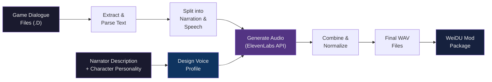

# PST AI Voices

### Full Voice Acting for Planescape: Torment Enhanced Edition

> *"What can change the nature of a man?"*
> *Now every character has a voice to ask.*

---

Planescape: Torment is one of the most text-rich RPGs ever made &mdash; over **800,000 words** of dialogue, but almost none of it voiced. This mod changes that.

**PST AI Voices** adds AI-generated voice acting to the game using modern text-to-speech technology. Every line of dialogue, every narrator description, every whispered threat in the Hive &mdash; spoken aloud with a unique voice crafted for each character.

This is a **free fan project** made for the love of the game. No monetization, no paywalls &mdash; just a mod for anyone who wants to experience Sigil and the Planes with full voice acting.

## By the Numbers

| | |
|---|---|
| **Characters voiced** | ~530 unique voices |
| **Total voice lines** | 14,000+ |
| **Dialogue coverage** | ~95% of all in-game text |
| **Voice profiles** | Each character has a distinct, hand-crafted voice |
| **Top 40 characters** | Extra voice refinement with multiple iterations |
| **Price** | Free, forever |

## Voice Samples

Listen to how key characters sound. Each voice was designed to match the character's personality, portrait, and role in the story.

> **Note:** Click the filename to download and listen. GitHub does not play audio inline.

### Narrator

| Character | Sample Line | Audio |
|-----------|------------|-------|
| **Narrator** | *"The shambling corpse gazes at you with vacant eyes. The number 463 is carved into his forehead, and his lips have been stitched closed. The faint smell of formaldehyde emanates from the body."* | [narrator_sample.wav](samples/narrator_sample.wav) |

### Companions

| Character | Sample Line | Audio |
|-----------|------------|-------|
| **Morte** | *"Hey, chief. You okay? You playing corpse or you putting the blinds on the Dusties?"* | [morte_sample.wav](samples/morte_sample.wav) |
| **Annah** | *"Oh, aye? It's good I sell corpses then, aye? Yeh look ready for the Dustman's furnace, skull."* | [annah_sample.wav](samples/annah_sample.wav) |
| **Fall-From-Grace** | *"Since she's been bound contractually, that means it's a project of Law. And since she's been bound magically, it is likely baatezu in origin."* | [grace_sample.wav](samples/grace_sample.wav) |
| **Dakkon** | *"I would be honored to meet another outcast, another exile. Perhaps the sharing of our shame will lessen its sting for both of us."* | [dakkon_sample.wav](samples/dakkon_sample.wav) |
| **Vhailor** | *"The state of the tree is irrelevant to me. Its death is neither just nor unjust &mdash; it simply is."* | [vhailor_sample.wav](samples/vhailor_sample.wav) |
| **Nordom** | *"Request: Aid Mourns (AKA Mourns-for-Trees) (Hold trees dear). Invalid command/object name."* | [nordom_sample.wav](samples/nordom_sample.wav) |
| **Ignus** | *"Buildingssss as SKELETONSSSS... Anglessss, bodiessss as skeletonssss... redsss and orangessss and blackssss, the flamessss sssspreading, caresssing... sssuch LIGHTSSSS..."* | [ignus_sample.wav](samples/ignus_sample.wav) |

### Key Story NPCs

| Character | Sample Line | Audio |
|-----------|------------|-------|
| **Ravel** | *"Great, great trials of war... much too much to be borne by any, any mortal thing."* | [ravel_sample.wav](samples/ravel_sample.wav) |
| **Pharod** | *"Chambers, vaults, corridors... filled with the dead, all a-sleep in their coffins. Somewhere in those halls, somewhere there, lies something miss-placed. Something mine."* | [pharod_sample.wav](samples/pharod_sample.wav) |
| **Trias** | *"What is it you wish of me, mortal? Speak your mind and then depart."* | [trias_sample.wav](samples/trias_sample.wav) |

## How Voices Are Generated

Every voice in this mod is created through a multi-step pipeline that tries to capture each character's personality:

### The Process

1. **Voice Design** &mdash; Each character's voice is manually crafted using the portrait painted by the narrator's descriptions &mdash; their appearance, mannerisms, and personality as revealed through dialogue. A sarcastic floating skull sounds different from a stoic githzerai warrior, which sounds different from a succubus philosopher.

2. **Text Extraction** &mdash; All dialogue lines are extracted from the game's compiled script files (`.D` format) and cross-referenced with the string table (`dialog.tlk`).

3. **Narration/Speech Split** &mdash; PST dialogue mixes spoken words with narrator descriptions (e.g., *He pauses.* "Then I'll tell you."). The pipeline splits these into separate segments and sends them to different voice profiles &mdash; a narrator voice for descriptions, the character voice for speech.

4. **Audio Generation** &mdash; Each segment is sent to [ElevenLabs](https://elevenlabs.io) for text-to-speech synthesis, then the segments are recombined into a single WAV file with appropriate pauses.

5. **Normalization** &mdash; All audio is volume-normalized to match the game's existing sound levels, so voices blend naturally with the music and sound effects.

### Why Not Clone the Original Voices?

The original Planescape: Torment has a small number of voiced lines (character select, battle cries). We cannot legally clone those voice actors' performances, so every voice in this mod is a **new, original interpretation** designed to fit each character. Think of it as a different cast performing the same script.

### The Top 40

The ~40 most important characters (companions, key NPCs, major side characters) received extra attention during voice design:
- Multiple voice iterations and A/B comparisons
- Fine-tuned speed, stability, and expressiveness per character
- Manual review of output quality across hundreds of lines

The remaining ~490 characters use carefully designed voices, but with fewer refinement passes.

## Installation

### Requirements
- Planescape: Torment Enhanced Edition (Steam, GOG, or Beamdog)
- ~1 GB disk space (OGG compressed) or ~5 GB (uncompressed WAV)

### Steps
1. Download the latest release from the [Releases](../../releases) page
2. Extract the archive into your PST:EE game directory
3. Run `setup-PST_AI_Voices.exe`
4. Select which voice packs to install:

| Component | Characters | Lines |
|-----------|-----------|-------|
| **Companion Voices** | Morte, Annah, Fall-From-Grace, Dakkon, Nordom, Vhailor, Ignus | ~2,400 |
| **Key Story NPCs** | Ravel, Trias, Pharod, Mebbeth, Lothar, Fhjull Forked-Tongue | ~750 |
| **Side NPCs** | Fell, Ebb, Hamrys, Yves, Soego, Incar, Pillar, Dolora, and more | ~1,300 |
| **Minor NPCs** | Hundreds of smaller characters throughout the game | ~10,000 |

You can install any combination &mdash; companions only, everything, or anything in between.

### Uninstall
Run `setup-PST_AI_Voices.exe` again and choose Uninstall. WeiDU restores all original files automatically.

## Known Limitations

- **AI-generated audio may contain artifacts** &mdash; occasional mispronunciations, odd emphasis, or slight audio glitches. This is the nature of current TTS technology.
- **Planescape-specific terminology** &mdash; Words like "baatezu," "githzerai," "Sigil" (pronounced "SIJ-il"), and planar slang sometimes trip up the TTS engine.
- **Dialogue continues after conversation ends** &mdash; If the last line in a conversation is long, the voice may keep playing after you close the dialogue window. This is an Infinity Engine limitation, not a mod bug.
- **~5% of dialogue unvoiced** &mdash; Some edge cases (dynamic text, heavily scripted sequences) are not covered.

## FAQ

**Q: Does this work with other mods?**
A: Yes. Since it uses WeiDU, it's compatible with other PST:EE mods. Install order shouldn't matter for most mods.

**Q: Can I use just the companion voices?**
A: Absolutely. Each component is independent &mdash; install only what you want.

**Q: The voices sound wrong / I don't like a voice.**
A: Taste is subjective! These are AI interpretations, not definitive versions. If a specific character sounds broken (glitches, wrong gender, etc.), please open an issue.

**Q: Why is the download so large?**
A: 14,000+ voice lines is a lot of audio. The OGG-compressed release is ~1 GB. The uncompressed version is ~5 GB.

**Q: Is this legal?**
A: This mod generates new, original voice performances using TTS. It does not clone, sample, or reproduce any existing voice actor's performance. It's distributed as a free fan mod.

## Credits

- **Voice Generation** &mdash; [ElevenLabs](https://elevenlabs.io) text-to-speech
- **Mod Packaging** &mdash; [WeiDU](https://weidu.org) Infinity Engine modding tool
- **Original Game** &mdash; Black Isle Studios / Interplay Entertainment / Beamdog

---

*This is a fan-made mod. It is not affiliated with, endorsed by, or connected to Beamdog, Black Isle Studios, Interplay Entertainment, or any rights holders of Planescape: Torment. All game content, characters, and dialogue text are the property of their respective owners.*
